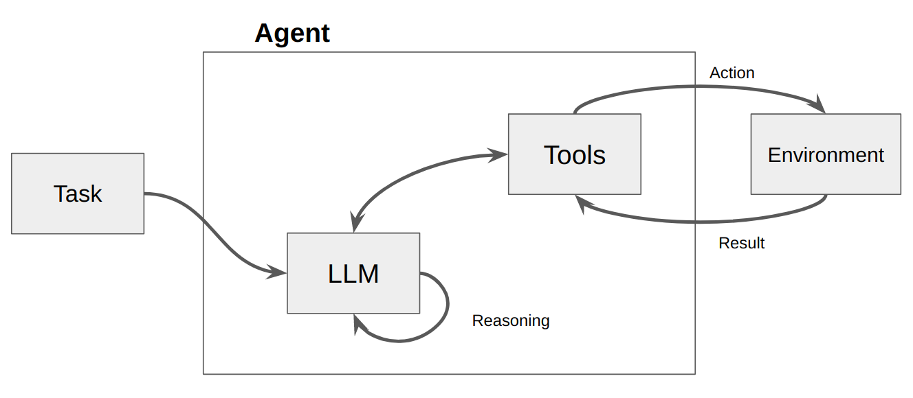

# Why RAG?

RAG boosts LLMs from storytellers to reliable assistants by weaving in real-world knowledge for factual, adaptable responses.


FUNCTION CALLING ORCHESTRATION EXPERIMENT - inspired by: [Interactive-RAG](https://github.com/ranfysvalle02/Interactive-RAG)

 **Function-calling should be used 'in addition to' vector search when applicable.** it does not need to replace 'vector search'. But function calling opens the possibility to rather than the 'vector search' part be included in the 'application code' it may be hidden behind an API and interacted with using function calling.

### _EXPERIMENTAL: FAR FROM READY, JUST GETTING STARTED_


The below README content is from the original repository. What we are doing on this experiment is replacing:

```
# replace vector search retrieval based on query and replace it with a step called: "r_n_d"
# "r_n_d" => generates google queries to answer the question, and summarizes the results.
# this "research" is then used to augment the context
# with the augmented context, an answer is formulated for the original query.
#vector_search.recall(
self.r_n_d(
    query
)
```


# R&D Step
```
    def r_n_d(
        self, text: str
    ):
        print("R&D starts now")
        response = self.llm.create(
                messages=[
                    {"role": "system", "content": "Use your actions/tools available to answer the user prompt."},
                    {"role": "system", "content":f"""
        [EXPECTED BEHAVIOR]
        # Input, Thought, Observation, Action
            - User Input: "What is kubernetes?"
            - Thought: I cannot provide a direct answer to the question "What is Kubernetes?".
            - Observation: I have an action available called "summarize_search_results". I will use this action to answer the user's question.
            - Action: "summarize_search_results"(original_query:str, queries_to_help_answer_the_original_query: List[min=4])
"""},
                    {"role": "user", "content": f"""
[user prompt]
{text}                  
[end user prompt]
                     
[summarized search results]
(insert output of summarize_search_results here)                     
[end summarized search results]

DO NOT ANSWER THE QUESTION DIRECTLY, ONLY OUTPUT THE 'summarized search results'
"""},
                ],
                actions=[self.summarize_search_results],
                stream=False,
            )
        print(response)
        print("R&D ends now")
        return response
```

# Action

```
    @action(name="summarize_search_results", stop=True)
    def summarize_search_results(self,original_query:str, queries: List) -> str:
        """
        Invoke this ALWAYS to summarize search results. It will help answer the original user query.
        It will only work if you have at least 4 "google search queries" that together will help build the best answer for the original user query.
        [EXAMPLE]
        - User Input: "what is kubernetes?"
        
        Args:
            original_query (str): The user's original query
            queries (List): list of at least 4 "google search queries" that together will help build the best answer for the original user query. [min=4]
        Returns:
            str: Text with the Google Search results
        """
        utils.print_log("Action: summarize_search_results")

        utils.print_log("Action: summarize_search_results->original_query: " + original_query)
        utils.print_log("Action: summarize_search_results->queries: " + str(queries))
        with self.st.spinner(f"Summarizing search results..."):
            result = ""
            for query in queries:
                web_search_results = self.search_web(query)
                first2 = extract_first_two_urls(web_search_results)
                for url in first2:
                    web_chunk = self.extract_plain_text(url)[:5000]
                    tmp_summary = self.llm.create(messages=[
                        {"role": "system", "content": "You are a helpful assistant that summarizes web content to help answer an original query. You are detail oriented and always strive to provide an accurate and detailed summary that helps best answer the original query."},
                        {"role": "system", "content": "[original query]"+original_query+"[end original query] \n\nfacts to consider:\n[current year=2024]\n\n"},
                        {"role": "user", "content": "Take note of direct quotes (min.length=4 sentences) that help answer the original query. BE AS VERBOSE AS POSSIBLE. USE LIST FORMAT AND ONLY INCLUDE QUOTES THAT ARE RELEVANT TO THE ORIGINAL QUERY. INCLUDE DETAILS THAT CAN HELP BUILD THE BEST POSSIBLE ANSWER TO THE ORIGINAL QUERY."},
                        {"role": "user", "content": "[web content to summarize if relevant to original query]:\n"+web_chunk+"[end web content] \n\n"},
                        {"role": "user", "content": "REMEMBER!! [original query]"+original_query+"[end original query] \n\n RETURN ONLY THE DETAILED QUOTES FROM THE TEXT IN LIST FORMAT."},
                    ],actions=[],stream=False)
                    result += f"[search='{query}']\n\nurl/source:{url}\nsummary:{tmp_summary}\n\n"
                result += "\n"
            print("Action: summarize_search_results->result: " + result)
            return result
```

# QUERY WITH R&D OUTPUT AS VERIFIED SOURCES:

```
LET'S PLAY A GAME. 
            THINK CAREFULLY AND STEP BY STEP.
            
            Given the following verified sources and a question, using only the verified sources content create a final detailed answer in markdown. 
            
            Remember while answering:
                - The only verified sources are between START VERIFIED SOURCES and END VERIFIED SOURCES.
                - Only display images and links if they are found in the verified sources
                - If displaying images or links from the verified sources, copy the images and links exactly character for character and make sure the URL parameters are the same.
                - Do not make up any part of an answer. 
                - Questions might be vague or have multiple interpretations, you must ask follow up questions in this case.
                - BE AS DETAILED AS POSSIBLE.
                - IF the verified sources can answer the question in multiple different ways, THEN respond with each of the possible answers.
                - Formulate your response using ONLY VERIFIED SOURCES. 

            [START VERIFIED SOURCES]
            [search='latest news Orlando FL']

url/source:https://www.wesh.com/local-news
summary:- "Local nonprofit to bring new approach to mental health services in Central Florida" - This quote indicates that there is a local nonprofit in Central Florida that is introducing a new approach to mental health services.
- "FHP: Driver found in pizzeria parking lot after hitting 3 pedestrians, killing 2 in Flagler County" - This quote mentions a driver who hit three pedestrians, resulting in the death of two individuals in Flagler County.
- "Flagler County to open cold weather shelter as temperatures drop in Central Florida this week" - This quote states that Flagler County is opening a cold weather shelter due to dropping temperatures in Central Florida.
- "FHP: 2 dead, 1 hurt in Flagler hit-and-run crash" - This quote highlights a hit-and-run crash in Flagler County that resulted in two deaths and one injury.
- "FHP: 1 motorcyclist dead after three-vehicle crash" - This quote mentions a three-vehicle crash that resulted in the death of a motorcyclist.
- "Police: Woman shot, injured in Orlando" - This quote indicates that a woman was shot and injured in Orlando.
- "FHP: Driver killed in Eustis crash" - This quote mentions a fatal crash in Eustis where a driver was killed.
- "Deputies: Suspect identified after woman killed in Marion County shooting" - This quote states that a suspect has been identified after a woman was killed in a shooting in Marion County.
- "Communities to honor Dr. Martin Luther King Jr. in Central Florida" - This quote mentions that communities in Central Florida will be honoring Dr. Martin Luther King Jr.
- "Eatonville parade celebrates Dr. Martin Luther King Jr.'s legacy" - This quote highlights a parade in Eatonville that celebrates the legacy of Dr. Martin Luther King Jr.
- "Police looking for driver in deadly Polk County hit-and-run crash" - This quote indicates that the police are searching for a driver involved in a deadly hit-and-run crash in Polk County.
- "National Transportation Safety Board investigating deadly Brightline crashes in Melbourne" - This quote mentions that the National Transportation Safety Board is investigating deadly crashes involving Brightline in Melbourne.

[search='latest news Orlando FL']

url/source:https://www.fox35orlando.com/local-news
summary:- "Man injured, woman dead after shooting in Orlando neighborhood, deputies say"
- "Reserved parking coming to Orlando International Airport"
- "Seminole County opening new fire station in Altamonte Springs"
- "Hit-and-run driver takes down traffic light pole at Lake Mary intersection, officials confirm"
- "Florida man speeding through Kissimmee in stolen Mercedes had 15,000 fentanyl pills on him, officials say"
- "Running list of Central Florida school closures due to severe weather"
- "Brevard County man arrested in deadly New Years Eve DUI crash in Cocoa Beach"
- "Volusia County using cash incentives to lure new lifeguards amid shortage"
- "Palm Coast elevates fix to new construction flooding as high priority"
- "Man, 80, found dead on side of Palm Coast road, deputies say"


[search='breaking news Orlando FL']

url/source:https://www.wesh.com/local-news
summary:- "Local nonprofit to bring new approach to mental health services in Central Florida" - This quote indicates that there is a local nonprofit in Central Florida that is introducing a new approach to mental health services.
- "FHP: Driver found in pizzeria parking lot after hitting 3 pedestrians, killing 2 in Flagler County" - This quote mentions a driver who hit three pedestrians, resulting in the death of two individuals in Flagler County.
- "Flagler County to open cold weather shelter as temperatures drop in Central Florida this week" - This quote states that Flagler County is opening a cold weather shelter due to dropping temperatures in Central Florida.
- "FHP: 2 dead, 1 hurt in Flagler hit-and-run crash" - This quote highlights a hit-and-run crash in Flagler County that resulted in two deaths and one injury.
- "FHP: 1 motorcyclist dead after three-vehicle crash" - This quote mentions a three-vehicle crash that resulted in the death of one motorcyclist.
- "Police: Woman shot, injured in Orlando" - This quote indicates that a woman was shot and injured in Orlando.
- "FHP: Driver killed in Eustis crash" - This quote mentions a fatal crash in Eustis where a driver was killed.
- "Deputies: Suspect identified after woman killed in Marion County shooting" - This quote states that a suspect has been identified after a woman was killed in a shooting in Marion County.
- "Communities to honor Dr. Martin Luther King Jr. in Central Florida" - This quote mentions that communities in Central Florida will be honoring Dr. Martin Luther King Jr.
- "Eatonville parade celebrates Dr. Martin Luther King Jr.'s legacy" - This quote highlights a parade in Eatonville that celebrates the legacy of Dr. Martin Luther King Jr.
- "Police looking for driver in deadly Polk County hit-and-run crash" - This quote indicates that the police are searching for a driver involved in a deadly hit-and-run crash in Polk County.
- "National Transportation Safety Board investigating deadly Brightline crashes in Melbourne" - This quote mentions that the National Transportation Safety Board is investigating deadly crashes involving Brightline in Melbourne.

[search='breaking news Orlando FL']

url/source:https://www.wftv.com/homepage
summary:- "Central Florida is honoring Dr. Martin Luther King Jr. with these events" - This quote indicates that there are events happening in Central Florida to honor Dr. Martin Luther King Jr. It is not directly related to the original query about news in Orlando and New York City, but it provides information about an event happening in Orlando.
- "Rain and storm chances increase before next strong cold front arrives" - This quote mentions that there will be an increase in rain and storm chances in the near future. While it doesn't specifically mention Orlando or New York City, it provides information about the weather conditions that could be relevant to both locations.
- "Woman, child escape serious injuries when tire slams into windshield" - This quote highlights an incident where a woman and child escaped serious injuries when a tire hit their windshield. Although it doesn't directly relate to the original query, it provides information about a local news event.
- "MCO 'Traveler' refreshed after four decades" - This quote mentions that the MCO 'Traveler' has been refreshed after four decades. While it doesn't directly relate to the original query, it provides information about a local development or renovation project in Orlando.


[search='news updates New York City']

url/source:https://www.nbcnewyork.com/
summary:- "Subfreezing temps in store before NYC has chance at breaking 700+ day snow record" - This quote indicates that New York City is expecting subfreezing temperatures and there is a chance of breaking a 700+ day snow record.
- "Dad critical after racing to save daughter trapped in fire; entire Queens family hospitalized" - This quote highlights a news story about a father who is in critical condition after trying to save his daughter from a fire in Queens. The entire family has been hospitalized.
- "Viral video shows shirtless Bills fan helping shovel snow at Highmark Stadium" - This quote mentions a viral video of a shirtless Buffalo Bills fan helping shovel snow at Highmark Stadium.
- "GOP candidates campaign down to the wire on eve of caucus" - This quote suggests that GOP candidates are campaigning vigorously on the eve of the caucus.
- "A defiant Netanyahu says no one can halt Israel's war to crush Hamas, including the wo..." - This quote mentions a defiant statement from Netanyahu, stating that no one can halt Israel's war to crush Hamas.
- "In closing pitch to Iowa Republicans, Trump says their votes can help him punish his e..." - This quote highlights Trump's closing pitch to Iowa Republicans, where he mentions that their votes can help him punish his enemies.
- "US says Texas barred border agents from entering park to try to save 3 migrants who dr..." - This quote mentions that Texas barred border agents from entering a park to try to save three migrants who drowned.
- "A weekend of ferocious winter weather could see low-temperature records set in the US ..." - This quote suggests that a weekend of severe winter weather could result in low-temperature records being set in the US.

[search='news updates New York City']

url/source:https://www.cbsnews.com/newyork/local-news/new-york/
summary:- "Man dies after being shot several times on 3 train in Brooklyn, NYPD says" - It happened just after 8 p.m. on Sunday. No arrests have been made.
- "Friends remember Lourdes Camilo, killed Saturday in hit-and-run in Bronx" - The 53-year-old is being remembered as a kind woman and a loving mother and grandmother.
- "Massive tree falls on home in Queens, no injuries reported" - Gusty winds may be to blame. Residents said they warned the city several times that it could happen.
- "Driver runs red light, injures 4 pedestrians in Midtown, NYPD says" - It happened at 48th Street and Sixth Avenue just after 2:30 p.m. on Sunday. No arrests have been made.
- "No further budget cuts coming to New York City libraries" - The three library systems had planned to make up cuts by closing libraries on Saturdays and reducing hours on weekdays.
- "First Alert Forecast: Snow squalls clear as arctic front sweeps region" - Temperatures will keep tumbling tonight. Lows will fall to around 20 degrees in New York City and the teens in the suburbs.
- "NYPD searching for driver of white SUV in fatal Bronx hit-and-run" - The victim was crossing the street in the crosswalk, but did not have the light at the time he was hit, police said.
- "Times Square hourglass represents time running out for Israeli hostages" - The group tipped the hourglass as a reminder that time is running out for their loved ones and called on world leaders to help bring their family members homes.
- "Queens streets resemble rivers after heavy rain causes floods" - There was so much water on roads and sidewalks that some people had difficulty walking.


[search='current events New York City']

url/source:https://www.cbsnews.com/newyork/local-news/new-york/
summary:- "Man dies after being shot several times on 3 train in Brooklyn, NYPD says" - It happened just after 8 p.m. on Sunday. No arrests have been made.
- "Friends remember Lourdes Camilo, killed Saturday in hit-and-run in Bronx" - The 53-year-old is being remembered as a kind woman and a loving mother and grandmother.
- "Massive tree falls on home in Queens, no injuries reported" - Gusty winds may be to blame. Residents said they warned the city several times that it could happen.
- "Driver runs red light, injures 4 pedestrians in Midtown, NYPD says" - It happened at 48th Street and Sixth Avenue just after 2:30 p.m. on Sunday. No arrests have been made.
- "No further budget cuts coming to New York City libraries" - The three library systems had planned to make up cuts by closing libraries on Saturdays and reducing hours on weekdays.
- "First Alert Forecast: Snow squalls clear as arctic front sweeps region" - Temperatures will keep tumbling tonight. Lows will fall to around 20 degrees in New York City and the teens in the suburbs.
- "NYPD searching for driver of white SUV in fatal Bronx hit-and-run" - The victim was crossing the street in the crosswalk, but did not have the light at the time he was hit, police said.
- "Times Square hourglass represents time running out for Israeli hostages" - The group tipped the hourglass as a reminder that time is running out for their loved ones and called on world leaders to help bring their family members homes.
- "Queens streets resemble rivers after heavy rain causes floods" - There was so much water on roads and sidewalks that some people had difficulty walking.

[search='current events New York City']

url/source:https://www.takewalks.com/blog/best-apps-nyc-culture-events
summary:1. "The best way to sort through the abundance of events in New York is to follow some of the best NYC events apps and websites. Find out about what’s happening in the City, as well as discounts and other special offers." 

2. "A free mobile version of the go-to NYC magazine. This easy-to-navigate app includes listings for art, comedy, museums and attractions, music, nightlife, film, theater, and things to do (as well as restaurants, bars, and shopping). You’ll also find curated lists, reviews, booking for tickets and reservations, and discounted offers. If you want to know about new places and read more about them before visiting, this may be the right app for you." 

3. "If anyone has their finger on the pulse of the City, it’s definitely the staff of the New York Times. You can find, both on their website and on their app, up-to-date listings of cultural offerings, events, and experiences (plus restaurants and bars). It also includes reviews and category lists by Times’ critics." 

4. "This website and app by the venerable magazine provides NYC event listings and recommendations from its critics. Browse curated listings by category—movies, art, nightlife, theater, dance, classical music, readings—and find recommendations. There are also audio tours, created by their esteemed writers, podcasts, and much more." 

5. "Produced by New York’s acclaimed PBS television program, the app and the official website include an arts calendar and video previews. The listings can be browsed by category, location, or venue, and you’ll find a detailed map to find anything your heart desires. Go beyond museums to explore the cities and maps with Culture Now. This app allows you to explore public art collections, historical and recent buildings, and cultural institutions."
            [END VERIFIED SOURCES]


            [ACTUAL QUESTION. ANSWER ONLY BASED ON VERIFIED SOURCES]:
            Summarize the news today for Orlando, FL and New York City

            # IMPORTANT! 
                - Final response must be expert quality markdown
                - The only verified sources are between START VERIFIED SOURCES and END VERIFIED SOURCES.
                - USE ONLY INFORMATION FROM VERIFIED SOURCES TO FORMULATE RESPONSE.
                - Do not make up any part of an answer - ONLY FORMULATE YOUR ANSWER USING VERIFIED SOURCES.
                - INCLUDE SECTIONS FOR ALL VERIFIED SOURCES USED TO FORMULATE THE ANSWER.
            Begin!
```
-------------------------------------------------------------------------------------------------------------------------------------------


# INTRODUCTION

Agents are revolutionizing the way we leverage language models for decision-making and task performance. Agents are systems that use language models to make decisions and perform tasks. They are designed to handle complex scenarios and provide more flexibility compared to traditional approaches. Agents can be thought of as reasoning engines that leverage language models to process information, retrieve relevant data, ingest(chunk/embed) and generate responses. 

In the future, agents will play a vital role in processing text, automating tasks, and improving human-computer interactions as language models advance.

In this example, we will specifically focus on leveraging agents in dynamic Retrieval Augmented Generation (RAG). Using ActionWeaver and MongoDB Atlas, you will have the ability to modify your RAG strategy in real-time through conversational interactions. Whether it's selecting more chunks, increasing chunk size, or tweaking other parameters, you can fine-tune your RAG approach to achieve the desired response quality and accuracy. You can even add/remove sources to your vector database using natural language! 


## 

# VIDEO

[DEMO 1](https://apollo-fv-mneqk.mongodbstitch.com/IRAG.mp4)

# FLOW
1. Ask Question
2. Check VectorStore -> If VectorStore results are not enough to answer, conversationally perform a web search
3. Add/Remove sources to VectorStore
4. Fine-tune RAG strategy for desired response quality 


## Getting Started
Create a new Python environment
```bash 
python3 -m venv env
```

Activate the new Python enviroment
```bash
source env/bin/activate
```

Install the requirements
```bash
pip3 install -r requirements.txt
```
Set the parameters in [params.py](rag/params.py):
```bash 
# MongoDB 
MONGODB_URI = ""
DATABASE_NAME = "genai"
COLLECTION_NAME = "rag"

# If using OpenAI
OPENAI_API_KEY = ""

# If using Azure OpenAI
OPENAI_TYPE = "azure"
OPENAI_API_VERSION = "2023-10-01-preview"
OPENAI_AZURE_ENDPOINT = "https://.openai.azure.com/"
OPENAI_AZURE_DEPLOYMENT = ""

```
Create a Search index with the following definition
```JSON
{
  "mappings": {
    "dynamic": true,
    "fields": {
      "embedding": {
        "dimensions": 384,
        "similarity": "cosine",
        "type": "knnVector"
      }
    }
  }
}
```

Set the environment
```bash
export OPENAI_API_KEY=
```

To run the RAG application

```bash
env/bin/streamlit run rag/app.py
```
Log information generated by the application will be appended to app.log.

## Usage
This bot supports the following actions: answer question, search the web, read URLs, remove sources, list all sources, and reset messages. 
It also supports an action called iRAG that lets you dynamically control your agent's RAG strategy. 

Ex: "set RAG config to 3 sources and chunk size 1250" => New RAG config:{'num_sources': 3, 'source_chunk_size': 1250, 'min_rel_score': 0, 'unique': True}.

```
 def __call__(self, text):
        text = self.preprocess_query(text)
        self.messages += [{"role": "user", "content":text}]
        response = self.llm.create(messages=self.messages, actions = [
            self.read_url,self.answer_question,self.remove_source,self.reset_messages,
            self.iRAG, self.get_sources_list,self.search_web
        ], stream=True)
        return response
```

If the bot is unable to provide an answer to the question from data stored in the Atlas Vector store, and your RAG strategy (number of sources, chunk size, min_rel_score, etc) it will initiate a web search to find relevant information. You can then instruct the bot to read and learn from those results. 

## Interactive Retrieval Augmented Generation

RAG is cool and all that, but coming up with the right "RAG strategy" is tricky. Chunk size, and the number of unique sources will have a direct impact on the response generated by the LLM. 

In developing an effective RAG strategy, the ingest process of web sources, chunking, embedding, chunk size, and the amount of sources used play crucial roles. Chunking breaks down the input text for better understanding, embedding captures the meaning, and the number of sources impacts response diversity. Finding the right balance between chunk size and the number of sources is essential for accurate and relevant responses. Experimentation and fine-tuning are necessary to determine optimal settings.

Before we dive into 'Retrieval', let's first talk about "Ingest Process"

## The "Ingest Process"

Why have a separate process to "ingest" your content into your vector database? Using the magic of agents, we can easily add new content to the vector database.

There are many types of databases that can store these embeddings, each with its own special uses. But for tasks involving GenAI applications, I recommend MongoDB.

Think of MongoDB as a cake that you can both have and eat. It gives you the power of its language for making queries, Mongo Query Language. It also includes all the great features of MongoDB. On top of that, it lets you store these building blocks (vector embeddings) and do math operations on them, all in one place. This makes MongoDB Atlas a one-stop shop for all your vector embedding needs!


### Detailed Breakdown:  
   
1. **Vector Embeddings**: MongoDB Atlas provides the functionality to store vector embeddings at the core of your document. These embeddings are generated by converting text, video, or audio into vectors utilizing models such as GPT4All, OpenAI or Hugging Face.  

```
    @action("read_url", stop=True)
    def read_url(self, urls: List[str]):
        """
        Invoke this ONLY when the user asks you to 'read', 'add' or 'learn' some URL(s). 
        This function reads the content from specified sources, and ingests it into the Knowledgebase.
        URLs may be provided as a single string or as a list of strings.
        IMPORTANT! Use conversation history to make sure you are reading/learning/adding the right URLs.

        Parameters
        ----------
        urls : List[str]
            List of URLs to scrape.

        Returns
        -------
        str
            A message indicating successful reading of content from the provided URLs.
        """
        with self.st.spinner(f"```Analyzing the content in {urls}```"):
            loader = PlaywrightURLLoader(urls=urls, remove_selectors=["header", "footer"])  
            documents = loader.load_and_split(self.text_splitter)
            self.index.add_documents(
                    documents
            )       
            return f"```Contents in URLs {urls} have been successfully ingested (vector embeddings + content).```"
```

2. **Indexing**: When employing vector search, it's necessary to create a search index. This process entails setting up the vector path, aligning the dimensions with your chosen model, and selecting a vector function for searching the top K-nearest neighbors.  
```
{
  "mappings": {
    "dynamic": true,
    "fields": {
      "embedding": {
        "dimensions": 384, #dimensions depends on the model
        "similarity": "cosine",
        "type": "knnVector"
      }
    }
  }
}
```
3. **Query Execution**: Once the vector embeddings are indexed, an aggregation pipeline can be created on your embedded vector data to execute queries and retrieve results. This is accomplished using the $vectorSearch operator, a new aggregation stage in Atlas.

```
def recall(self, text, n_docs=2, min_rel_score=0.25, chunk_max_length=800,unique=True):
        #$vectorSearch
        print("recall=>"+str(text))
        response = self.collection.aggregate([
        {
            "$vectorSearch": {
                "index": "default",
                "queryVector": self.gpt4all_embd.embed_query(text), #GPT4AllEmbeddings()
                "path": "embedding",
                #"filter": {},
                "limit": 15, #Number (of type int only) of documents to return in the results. Value can't exceed the value of numCandidates.
                "numCandidates": 50 #Number of nearest neighbors to use during the search. You can't specify a number less than the number of documents to return (limit).
            }
        },
        {
            "$addFields": 
            {
                "score": {
                "$meta": "vectorSearchScore"
            }
        }
        },
        {
            "$match": {
                "score": {
                "$gte": min_rel_score
            }
        }
        },{"$project":{"score":1,"_id":0, "source":1, "text":1}}])
        tmp_docs = []
        str_response = []
        for d in response:
            if len(tmp_docs) == n_docs:
                break
            if unique and d["source"] in tmp_docs:
                continue
            tmp_docs.append(d["source"])
            str_response.append({"URL":d["source"],"content":d["text"][:chunk_max_length],"score":d["score"]})
        kb_output = f"Knowledgebase Results[{len(tmp_docs)}]:\n```{str(str_response)}```\n## \n```SOURCES: "+str(tmp_docs)+"```\n\n"
        self.st.write(kb_output)
        return str(kb_output)
```


# BUILDING A RAG-AGENT

Using [ActionWeaver](https://github.com/TengHu/ActionWeaver/tree/main), a lightweight wrapper for function calling API, we can build a user proxy agent that efficiently retrieves and ingests relevant information using MongoDB Atlas. 

A proxy agent is a middleman sending client requests to other servers or resources and then bringing responses back. 

This agent presents the data to the user in an interactive and customizable manner, enhancing the overall user experience.

The `UserProxyAgent` has several RAG parameters that can be customized, such as `chunk_size`(e.g. 1000), `num_sources`(e.g. 2), `unique`(e.g. True) and `min_rel_score`(e.g. 0.00).

```
class UserProxyAgent:
    def __init__(self, logger, st):
        self.rag_config = {
            "num_sources": 2,
            "source_chunk_size": 1000,
            "min_rel_score": 0.00,
            "unique": True,
        }
```

## Why Choose ActionWeaver? 
Here are some key benefits that influenced our decision to choose ActionWeaver:
1. Lightweight and Single-Purposed: ActionWeaver is very lightweight and designed with a singular focus on building LLM applications with function calling. This specialization ensures that it excels in its core function without unnecessary complexity.
2. Ease of Use:  ActionWeaver streamlines the process of integrating external tools into agent's toolkit. Using a simple decorator, developers can effortlessly add any Python function, and it also provides the flexibility to include tools from other ecosystems like LangChain or Llama Index.
3. Versatility: Despite its simplicity, ActionWeaver offers a wide range of capabilities, including support for forced function execution, parallel function calling and structured data extraction. Such versatility makes it a Swiss Army knife, equipped to handle a variety of AI-related tasks and adapt seamlessly to changing project demands.
4. Minimal Dependency: ActionWeaver has minimal dependencies, relying only on the openai and pydantic libraries. This reduces the overhead of managing dependencies.
5. Complex Function Orchestration: The framework empowers us to create intricate sequences of function calls, allowing us to build complex hierarchies or chains of functions. This capability enables us to execute sophisticated workflows with ease. 

## ActionWeaver Basics: What is an Agent anyway?

An agent is basically just a computer program or system designed to perceive its environment, make decisions, and achieve specific goals.

Think of an agent as a software entity that displays some degree of autonomy and performs actions in its environment on behalf of its user or owner, but in a relatively independent way. It takes initiatives to perform actions on its own by deliberating its options to achieve its goal(s). The core idea of agents is to use a language model to choose a sequence of actions to take. In contrast to chains, where a sequence of actions is hardcoded in code, agents use a language model as a reasoning engine to determine which actions to take and in which order.

### Actions

Actions are functions that an agent can invoke. There are two important design considerations around actions:

    Giving the agent access to the right actions
    Describing the actions in a way that is most helpful to the agent

Without thinking through both, you won’t be able to build a working agent. If you don’t give the agent access to a correct set of actions, it will never be able to accomplish the objectives you give it. If you don’t describe the actions well, the agent won’t know how to use them properly.



An LLM is then called, resulting in either a response to the user OR action(s) to be taken. If it is determined that a response is required, then that is passed to the user, and that cycle is finished. If it is determined that an action is required, that action is then taken, and an observation (action result) is made. That action & corresponding observation are added back to the prompt (we call this an “agent scratchpad”), and the loop resets, ie. the LLM is called again (with the updated agent scratchpad).

In ActionWeaver, we can influence the loop adding `stop=True|False` to an action. 
If `stop=True`, the LLM will immediately return the function's output. This will also restrict the LLM from making multiple function calls.
In this demo we will only be using `stop=True`

ActionWeaver also supports more complex loop control using `orch_expr(SelectOne[actions])` and `orch_expr(RequireNext[actions])`, but I'll leave that for PART II.


The ActionWeaver agent framework is an AI application framework that puts function-calling at its core. It is designed to enable seamless merging of traditional computing systems with the powerful reasoning capabilities of Language Model Models. 
ActionWeaver is built around the concept of LLM function calling, while popular frameworks like Langchain and Haystack are built around the concept of pipelines. 

## Key features of ActionWeaver include:
- Ease of Use: ActionWeaver allows developers to add any Python function as a tool with a simple decorator. The decorated method's signature and docstring are used as a description and passed to OpenAI's function API.
- Function Calling as First-Class Citizen: Function-calling is at the core of the framework.
- Extensibility: Integration of any Python code into the agent's toolbox with a single line of code, including tools from other ecosystems like LangChain or Llama Index.
- Function Orchestration: Building complex orchestration of function callings, including intricate hierarchies or chains.
- Debuggability: Structured logging improves the developer experience.

## Key features of OpenAI functions include:
- Function calling allows you to connect large language models to external tools.
- The Chat Completions API generates JSON that can be used to call functions in your code.
- The latest models have been trained to detect when a function should be called and respond with JSON that adheres to the function signature.
- Building user confirmation flows is recommended before taking actions that impact the world on behalf of users.
- Function calling can be used to create assistants that answer questions by calling external APIs, convert natural language into API calls, and extract structured data from text.
- The basic sequence of steps for function calling involves calling the model, parsing the JSON response, calling the function with the provided arguments, and summarizing the results back to the user.
- Function calling is supported by specific model versions, including gpt-4 and gpt-3.5-turbo.
- Parallel function calling allows multiple function calls to be performed together, reducing round-trips with the API.
- Tokens are used to inject functions into the system message and count against the model's context limit and billing.


Read more at: https://thinhdanggroup.github.io/function-calling-openai/


## ActionWeaver Basics: actions
Developers can attach ANY Python function as a tool with a simple decorator. In the following example, we introduce action get_sources_list, which will be invoked by the OpenAI API.

ActionWeaver utilizes the decorated method's signature and docstring as a description, passing them along to OpenAI's function API.

ActionWeaver provides a light wrapper that takes care of converting the docstring/decorator information into the correct format for the OpenAI API.

```
@action(name="get_sources_list", stop=True)
    def get_sources_list(self):
        """
        Invoke this to respond to list all the available sources in your knowledge base.
        Parameters
        ----------
        None
        """
        sources = self.collection.distinct("source")  
        
        if sources:  
            result = f"Available Sources [{len(sources)}]:\n"  
            result += "\n".join(sources[:5000])  
            return result  
        else:  
            return "N/A"  
```

## ActionWeaver Basics: stop=True

stop=True when added to an action means that the LLM will immediately return the function's output, but this also restrict the LLM from making multiple function calls. For instance, if asked about the weather in NYC and San Francisco, the model would invoke two separate functions sequentially for each city. However, with `stop=True`, this process is interrupted once the first function returns weather information  for either NYC or San Francisco, depending on which city it queries first.


For a more in-depth understanding of how this bot works under the hood, please refer to the bot.py file. 
Additionally, you can explore the [ActionWeaver](https://github.com/TengHu/ActionWeaver/tree/main) repository for further details.


# ReAct Prompt Technique + Chain of Thought
Generating reasoning traces allow the model to induce, track, and update action plans, and even handle exceptions.
This example uses ReAct combined with chain-of-thought (CoT).

[Chain of Thought](https://www.promptingguide.ai/techniques/cot)

[Reasoning + Action](https://www.promptingguide.ai/techniques/react)

```
[EXAMPLES]
- User Input: What is MongoDB?
- Thought: I have to think step by step. I should not answer directly, let me check my available actions before responding.
- Observation: I have an action available "answer_question".
- Action: "answer_question"('What is MongoDB?')

- User Input: Reset chat history
- Thought: I have to think step by step. I should not answer directly, let me check my available actions before responding.
- Observation: I have an action available "reset_messages".
- Action: "reset_messages"()

- User Input: remove source https://www.google.com, https://www.example.com
- Thought: I have to think step by step. I should not answer directly, let me check my available actions before responding.
- Observation: I have an action available "remove_source".
- Action: "remove_source"(['https://www.google.com', 'https://www.example.com'])

- User Input: read https://www.google.com, https://www.example.com
- Thought: I have to think step by step. I should not answer directly, let me check my available actions before responding.
- Observation: I have an action available "read_url".
- Action: "read_url"(['https://www.google.com','https://www.example.com'])
[END EXAMPLES]
```

Both Chain of Thought (CoT) and ReAct prompting techniques come into play in these examples. Here's how:

**Chain of Thought (CoT) Prompting:**

* **Reasoning**: In each example, the model uses internal reasoning before responding. It doesn't directly answer the user input but instead thinks through the steps involved:
    * Identifying available actions ("answer_question", "reset_messages", "remove_source", "read_url")
    * Choosing the appropriate action based on the user input
    * Executing the chosen action
* **Observation**: The model observes the available actions before taking any action. This allows it to be more deliberate and avoid making mistakes.
* **Action**: The model then executes the chosen action, resulting in the desired outcome.

**ReAct Prompting:**

* **Synergy between reasoning and acting**: ReAct builds upon CoT by adding a further level of interaction with the environment. This allows the model to:
    * **Gather additional information**: In some cases, the model may need more information from the environment before taking action. For example, in the "read_url" example, the model needs to read the content of the specified URLs before it can answer any questions about them.
    * **Update action plans**: Based on the gathered information, the model can revise its initial plan and adjust its actions accordingly.
    * **Make decisions in real-time**: ReAct allows the model to interact with its environment and react to changes in real-time. This makes it more adaptable and versatile in complex situations.

In summary, both CoT and ReAct play a crucial role in these examples. CoT enables the model to reason step-by-step and choose appropriate actions, while ReAct extends this functionality by allowing the model to interact with its environment and update its plans accordingly. This combination of reasoning and action makes large language models more flexible and versatile, enabling them to handle a wider range of tasks and situations.

## DEMO

Let's start by asking our agent a question. In this case, **"What is a mango?"**. The first thing that will happen is, it will try to "recall" any relevant information using vector embedding similarity. It will then formulate a response with the content it "recalled", or will perform a web search. Since our knowledgebase is currently empty, we need to add some sources before it can formulate a response.


Since the bot is unable to provide an answer using the content in the vector database, it initiated a Google search to find relevant information. We can now tell it which sources it should "learn". In this case, we'll tell it to learn the first two sources from the search results.

## Tell the bot which results to learn from: 


## Change RAG strategy

Next, let's modify the RAG strategy! Let's make it only use one source, and have it use a small chunk size of 500 characters.


Notice that though it was able to retrieve a chunk, with a fairly high relevance score, it was not able to generate a response because the chunk size was too small and the chunk content was not relevant enough to formulate a response. Since it could not generate a response with the small chunk, it performed a web search on the user's behalf. 

Let's see what happens if we increase the chunk size to be 3000 characters instead of 500. 


Now, with a larger chunk size, it was able to accurately formulate the response using the knowledge from the vector database! 

## List All Sources

Let's see what's available in the knowledge base of the Agent by asking it: **What sources do you have in your knowledge base?**


## Remove a source of information

If you want to remove a specific resource, you could do something like:
```
USER: remove source 'https://www.oracle.com' from the knowledge base
```

To remove all the sources in the collection - We could do something like:

```
USER: what sources do you have in your knowledge base?
AGENT: {response}
USER: remove all those sources please
```


This demo has provided a glimpse into the inner workings of our AI agent, showcasing its ability to learn and respond to user queries in an interactive manner. We've witnessed how it seamlessly combines its internal knowledge base with real-time web search to deliver comprehensive and accurate information. The potential of this technology is vast, extending far beyond simple question-answering. None of this would be possible without the magic of the **Function Calling API**.

## Credit
This was inspired by https://github.com/TengHu/Interactive-RAG

## Additional MongoDB Resources

- https://www.mongodb.com/developer/products/atlas/taking-rag-to-production-documentation-ai-chatbot/
- https://www.mongodb.com/basics/what-is-artificial-intelligence
- https://www.mongodb.com/basics/vector-databases
- https://www.mongodb.com/basics/semantic-search
- https://www.mongodb.com/basics/machine-learning-healthcare
- https://www.mongodb.com/basics/generative-ai
- https://www.mongodb.com/basics/large-language-models
- https://www.mongodb.com/basics/retrieval-augmented-generation

## Additional Reading
- https://blog.langchain.dev/openais-bet-on-a-cognitive-architecture/

## Contributing
We welcome contributions from the open-source community.

## License
Apache License 2.0
